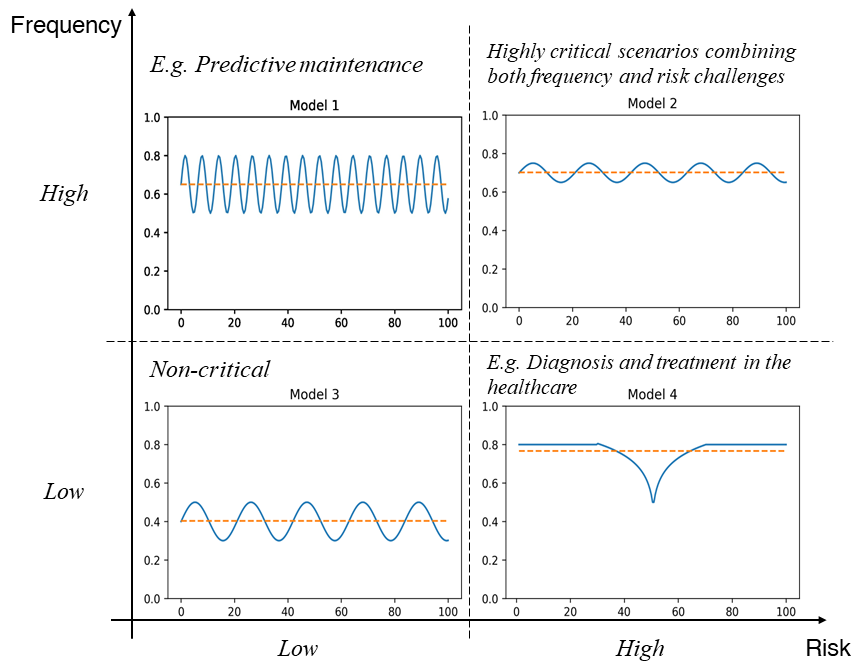

# Measuring Stability of Online Process Outcome Prediction Frameworks
## Suhwan Lee 1, Marco Comuzzi2, Xixi Lu1, Hajo A. Reijers1

1 Utrecht University, Utrecht, The Netherlands

2 Ulsan National Institute of Science and Technology, Ulsan, Republic of Korea

## Motivation
To highlight the need for more nuanced performance metrics in outcome-based predictive process monitoring, we introduce a classification of business scenarios along two dimensions: the _frequency_ of and the _risk_ associated with the decisions taken using a predictive monitoring model.

    </img>

## The four meta-measures

1. Frequency of significant performance drop

Given the sequence of performance values $\theta = \langle p_1, ..., p_n \rangle$ and the drops $\mathcal{D}(\theta) = \{D_1, ..., D_m\}$, the (normalized) frequency $\mathbb{F}$ of significant performance drops is defined as follows:

</img>

1. Volatility of performance

Given the sequence of the standard deviations $\langle \varphi_1, ..., \varphi_n \rangle$, the average of the sequence of standard deviations $\mathbb{V}_{perf}$ is defined as follows: 

</img>

1. Magnitude of performance drop

The magnitude of performance drop is the difference between a drop point $p_{i}$ and the moving average $ma_i$, i.e., $\lvert p_i - ma_i \rvert$. 
We then define the maximum magnitude $\mathbb{M}\_{max}$ and the average magnitude $\mathbb{M}\_{avg}$ of performance drop as follows:

</img>

</img>

1. Recovery rate

The recovery rate of a significant drop $D_{i}$ is calculated by counting the number of drop points in a drop, i.e., $\lvert D\_{i} \rvert$. Having defined the recovery rate of a significant drop, the recovery ability of the predictive framework is measured by the average of the recovering rate of all drops, given the performance result $\theta$. It is calculated using the average of the collected recovery rate. 

The average recovery rate ($\mathbb{R}_{avg}$) of the performance result $\theta$ is defined as follows:

</img>

<h1>
<a href="https://github.com/ghksdl6025/online_ppm_stability/blob/master/Empirical_results.md">Empirical result</a>
</h1>